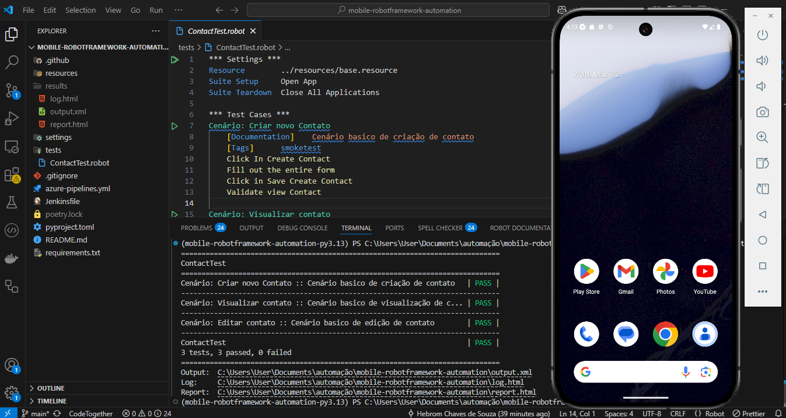

### 📱 MOBILE-ROBOTFRAMEWORK-CONTACTS

Este projeto é uma suíte de automação de testes para aplicativos móveis utilizando Robot Framework com Appium. Ele automatiza cenários de Create, Read, Update para a aplicação de contatos, garantindo que funcionalidades essenciais estejam funcionando corretamente.



### 🗂️ Estrutura do Projeto

```sh
MOBILE-ROBOTFRAMEWORK
├── .github/                   # Pipeline GitActions (opcional)
├── resources/
│   ├── elements/              # Mapeamento dos elementos de tela em YAML
│   │   ├── contactsElements.yml
│   │   ├── createContactElements.yml
│   │   ├── editContactElements.yml
│   │   └── viewContactElements.yml
│   ├── pages/                 # Pages Objects em Robot Framework (resource)
│   │   ├── basePage.resource
│   │   ├── contactsPage.resource
│   │   ├── createContactPage.resource
│   │   ├── editContactPage.resource
│   │   └── viewContactPage.resource
│   └── utils/                 # Utils e funções customizadas
│       ├── customKeywords.resource
│       ├── fakerObjects.resource
│       └── openApp.resource
├── settings/                  # Configurações de ambiente
│   └── browserstack_ios_config.yaml
├── tests/                     # Casos de testes
│   └── ContactTest.robot
├── jenkinsfile                # Pipeline Jenkins (opcional)
├── azure-pipelines.yml        # Pipeline Azure DevOps (opcional)
├── poetry.lock                # Lockfile do Poetry
└── pyproject.toml             # Dependências Python e configuração do projeto
```

### ✅ Funcionalidades Automatizadas
Casos de Teste

    Criar novo contato
    Visualizar contato
    Editar contato

Cada cenário testa uma funcionalidade essencial para o gerenciamento de contatos no aplicativo.
### ⚙️ Tecnologias e Ferramentas

- Robot Framework - Framework principal para automação.
- Appium - Integração com dispositivos Android/iOS.
- Python + Poetry - Gerenciamento de dependências.
- Faker - Geração de dados falsos para testes (fakerObjects).
- Jenkins / Azure DevOps - CI/CD pipelines para execução automatizada.

### 🚀 Pré-requisitos

    Python 3.9+
    Poetry
    Appium Server
    Emulador Android/iOS ou dispositivo real
    Node.js (para Appium)

### 🛠️ Instalação do Projeto

Clone o repositório
```sh
git clone https://github.com/hebroms/mobile-robotframework-automation.git
```
```sh
cd mobile-robotframework-automation
```

Instale as dependências
```sh
poetry install
```
Inicie o Appium Server
```sh
appium
```
Configure o dispositivo/emulador

### ▶️ Como Executar os Testes
Rodar todos os testes:
```sh
poetry run robot -d ./results tests/ContactTest.robot
```
Rodar cenários específicos:
```sh
poetry run robot --include smoketest -d ./results tests/ContactTest.robot
```
Rodar em diferentes plataformas:

Configure a variável PLATFORM_NAME no seu ambiente ou settings/base.resource:

    Android
    iOS

### 📝 Personalizações
Faker Objects

Geração dinâmica de dados para:

    Nome
    Sobrenome
    Empresa
    Telefone
    Email
    Datas importantes

Custom Keywords

Localizadas em resources/utils/customKeywords.resource, centralizam ações comuns como:

    Scroll
    Fechar pop-ups inesperados
    Manipular DatePicker

### 📂 CI/CD Pipeline

Automação com:

    Jenkinsfile
    azure-pipelines.yml

Garante a execução em diferentes ambientes e dispositivos de forma contínua.

### ✉️ Contato

Em caso de dúvidas ou sugestões:

    Email: hebromsouza@gmail.com
    LinkedIn: https://www.linkedin.com/in/hebrom-c-s/

Se quiser customizar algum trecho ou adicionar instruções específicas do seu ambiente, me fala! 